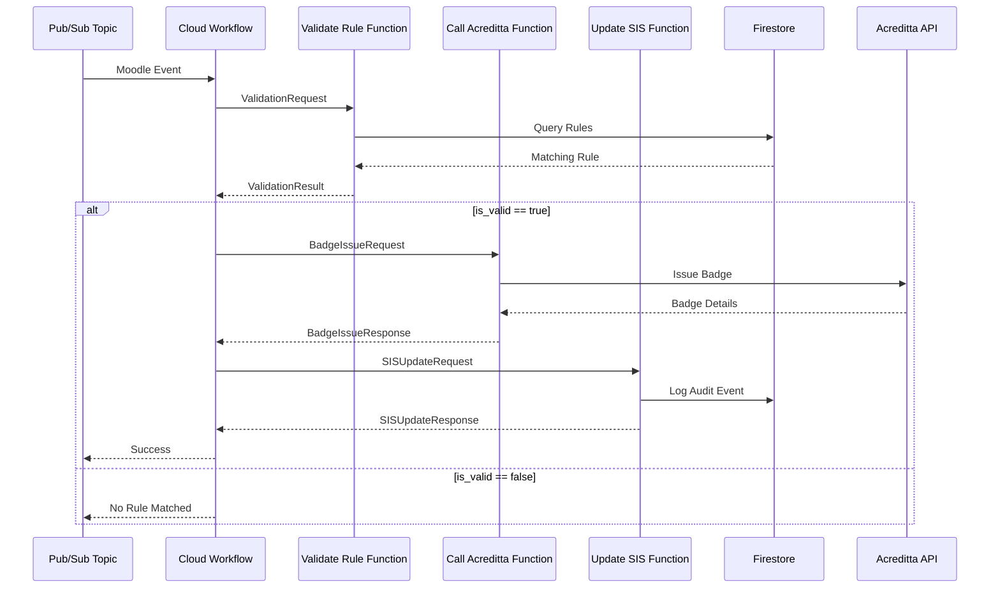

# API Contracts - CCA System

This document defines the API contracts for all Cloud Functions in the CCA system.

## Table of Contents

- [Validate Rule Function](#validate-rule-function)
- [Call Acreditta Function](#call-acreditta-function)
- [Update SIS Function](#update-sis-function)
- [Workflow Data Flow](#workflow-data-flow)
- [Error Responses](#error-responses)

---

## Validate Rule Function

**Endpoint**: `cca-validate-rule`  
**Method**: POST  
**Purpose**: Validates badge issuance rules from Firestore based on evaluation criteria

### Input Schema

```json
{
  "student_id": "string",
  "course_id": "string",
  "evaluation_id": "string",
  "score": 85.5,
  "timestamp": "2025-12-03T12:00:00Z"
}
```

| Field | Type | Required | Description |
|-------|------|----------|-------------|
| student_id | string | Yes | Unique student identifier |
| course_id | string | Yes | Course identifier |
| evaluation_id | string | Yes | Evaluation/assessment identifier |
| score | number | Yes | Score (0-100) |
| timestamp | string | Yes | ISO 8601 timestamp |

### Output Schema (Success)

```json
{
  "is_valid": true,
  "rule_id": "rule-001",
  "badge_template_id": "excellence-badge",
  "badge_title": "Excellence in Mathematics",
  "reason": "Score 85.5 meets minimum 80"
}
```

| Field | Type | Description |
|-------|------|-------------|
| is_valid | boolean | Whether a matching rule was found |
| rule_id | string | ID of the matched rule (null if no match) |
| badge_template_id | string | Badge template to issue (null if no match) |
| badge_title | string | Title of the badge (null if no match) |
| reason | string | Explanation of validation result |

### Output Schema (No Match)

```json
{
  "is_valid": false,
  "rule_id": null,
  "badge_template_id": null,
  "badge_title": null,
  "reason": "No rule matched the criteria"
}
```

---

## Call Acreditta Function

**Endpoint**: `cca-call-acreditta`  
**Method**: POST  
**Purpose**: Issues digital badges via Acreditta API

### Input Schema

```json
{
  "student_id": "12345",
  "badge_template_id": "excellence-badge",
  "badge_title": "Excellence in Mathematics",
  "course_id": "MATH101",
  "evaluation_id": "final_exam",
  "score": 85.5,
  "rule_id": "rule-001",
  "metadata": {
    "additional": "data"
  }
}
```

| Field | Type | Required | Description |
|-------|------|----------|-------------|
| student_id | string | Yes | Student identifier |
| badge_template_id | string | Yes | Acreditta badge template ID |
| badge_title | string | Yes | Title for the badge |
| course_id | string | Yes | Course identifier |
| evaluation_id | string | Yes | Evaluation identifier |
| score | number | Yes | Student score |
| rule_id | string | Yes | Rule that triggered issuance |
| metadata | object | No | Additional metadata |

### Output Schema

```json
{
  "badge_id": "badge-abc123",
  "badge_url": "https://acreditta.com/badges/badge-abc123",
  "issued_at": "2025-12-03T12:05:30Z",
  "status": "issued"
}
```

| Field | Type | Description |
|-------|------|-------------|
| badge_id | string | Unique badge identifier from Acreditta |
| badge_url | string | Public URL to view/share the badge |
| issued_at | string | ISO 8601 timestamp of issuance |
| status | string | Badge status (e.g., "issued", "pending") |

---

## Update SIS Function

**Endpoint**: `cca-update-sis`  
**Method**: POST  
**Purpose**: Updates SIS database and logs audit events to Firestore

### Input Schema

```json
{
  "student_id": "12345",
  "badge_id": "badge-abc123",
  "badge_url": "https://acreditta.com/badges/badge-abc123",
  "badge_template_id": "excellence-badge",
  "badge_title": "Excellence in Mathematics",
  "course_id": "MATH101",
  "evaluation_id": "final_exam",
  "score": 85.5,
  "rule_id": "rule-001",
  "issued_at": "2025-12-03T12:05:30Z",
  "workflow_execution_id": "wf-exec-123"
}
```

| Field | Type | Required | Description |
|-------|------|----------|-------------|
| student_id | string | Yes | Student identifier |
| badge_id | string | Yes | Badge identifier from Acreditta |
| badge_url | string | Yes | Badge URL |
| badge_template_id | string | Yes | Badge template ID |
| badge_title | string | Yes | Badge title |
| course_id | string | Yes | Course identifier |
| evaluation_id | string | Yes | Evaluation identifier |
| score | number | Yes | Student score |
| rule_id | string | Yes | Rule ID |
| issued_at | string | Yes | Badge issuance timestamp |
| workflow_execution_id | string | No | Workflow execution ID for tracing |

### Output Schema

```json
{
  "updated": true,
  "event_id": "evt-uuid-123",
  "message": "SIS updated and event logged successfully"
}
```

| Field | Type | Description |
|-------|------|-------------|
| updated | boolean | Whether SIS was successfully updated |
| event_id | string | UUID of the audit event |
| message | string | Status message |

---

## Workflow Data Flow

The Cloud Workflow orchestrates the three functions in sequence:



### Workflow Execution States

| State | Description |
|-------|-------------|
| SUCCESS | All steps completed successfully |
| VALIDATION_FAILED | Rule validation step failed |
| NO_RULE_MATCHED | No matching rule found (not an error) |
| BADGE_ISSUANCE_FAILED | Acreditta API call failed |
| SIS_UPDATE_FAILED | SIS update failed (badge still issued) |

---

## Error Responses

All functions return standardized error responses:

### 400 Bad Request

```json
{
  "error": "Validation error: field 'score' must be between 0 and 100"
}
```

### 500 Internal Server Error

```json
{
  "error": "Internal server error: Unable to connect to Firestore"
}
```

### Common Error Scenarios

| Scenario | Function | Status Code | Error Message |
|----------|----------|-------------|---------------|
| Invalid JSON | All | 400 | "Invalid JSON body" |
| Missing required field | All | 400 | "Validation error: field 'X' required" |
| Score out of range | Validate Rule | 400 | "Validation error: score must be 0-100" |
| Firestore connection failure | Validate Rule, Update SIS | 500 | "Unable to connect to Firestore" |
| Acreditta API failure | Call Acreditta | 500 | "Acreditta API error: ..." |
| Secret not found | Call Acreditta, Update SIS | 500 | "Secret 'X' not found" |

---

## Firestore Data Models

### Emission Rule (Collection: `reglas_emision`)

```json
{
  "rule_id": "rule-001",
  "course_id": "MATH101",
  "evaluation_id": "final_exam",
  "min_score": 80,
  "badge_template_id": "excellence-badge",
  "badge_title": "Excellence in Mathematics",
  "active": true,
  "created_at": "2025-12-01T00:00:00Z",
  "updated_at": "2025-12-01T00:00:00Z"
}
```

### Audit Event (Collection: `registro_evento`)

```json
{
  "event_id": "evt-uuid-123",
  "event_type": "badge_issued",
  "student_id": "12345",
  "badge_id": "badge-abc123",
  "badge_template_id": "excellence-badge",
  "course_id": "MATH101",
  "evaluation_id": "final_exam",
  "score": 85.5,
  "rule_id": "rule-001",
  "workflow_execution_id": "wf-exec-123",
  "timestamp": "2025-12-03T12:05:35Z",
  "metadata": {
    "badge_url": "https://acreditta.com/badges/badge-abc123",
    "badge_title": "Excellence in Mathematics",
    "issued_at": "2025-12-03T12:05:30Z",
    "sis_updated": true
  }
}
```

---

## Testing Examples

### cURL Examples

**Test Validate Rule:**
```bash
curl -X POST https://REGION-PROJECT_ID.cloudfunctions.net/cca-validate-rule \
  -H "Authorization: Bearer $(gcloud auth print-identity-token)" \
  -H "Content-Type: application/json" \
  -d '{
    "student_id": "12345",
    "course_id": "MATH101",
    "evaluation_id": "final_exam",
    "score": 85,
    "timestamp": "2025-12-03T12:00:00Z"
  }'
```

**Test Call Acreditta:**
```bash
curl -X POST https://REGION-PROJECT_ID.cloudfunctions.net/cca-call-acreditta \
  -H "Authorization: Bearer $(gcloud auth print-identity-token)" \
  -H "Content-Type: application/json" \
  -d '{
    "student_id": "12345",
    "badge_template_id": "excellence-badge",
    "badge_title": "Excellence in Mathematics",
    "course_id": "MATH101",
    "evaluation_id": "final_exam",
    "score": 85,
    "rule_id": "rule-001"
  }'
```

**Test Update SIS:**
```bash
curl -X POST https://REGION-PROJECT_ID.cloudfunctions.net/cca-update-sis \
  -H "Authorization: Bearer $(gcloud auth print-identity-token)" \
  -H "Content-Type: application/json" \
  -d '{
    "student_id": "12345",
    "badge_id": "badge-abc123",
    "badge_url": "https://acreditta.com/badges/badge-abc123",
    "badge_template_id": "excellence-badge",
    "badge_title": "Excellence in Mathematics",
    "course_id": "MATH101",
    "evaluation_id": "final_exam",
    "score": 85,
    "rule_id": "rule-001",
    "issued_at": "2025-12-03T12:05:30Z"
  }'
```
